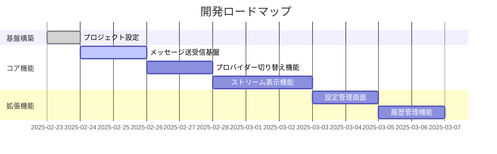
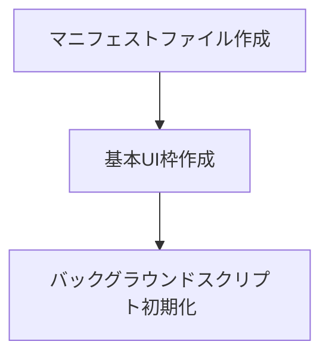
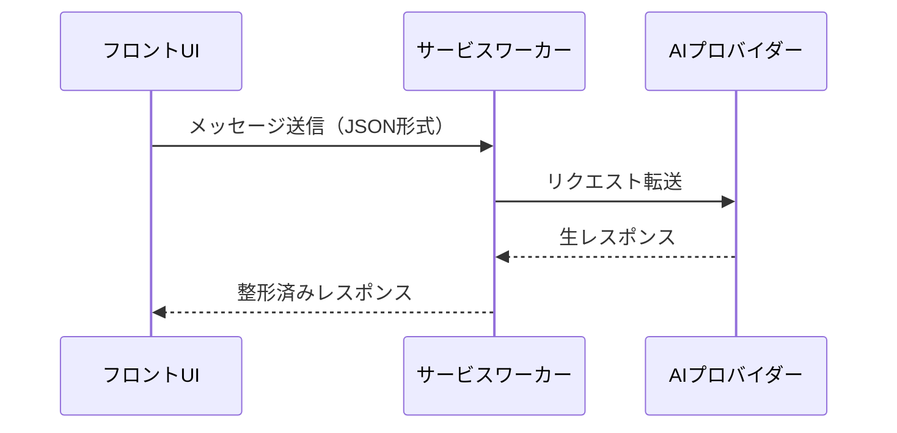
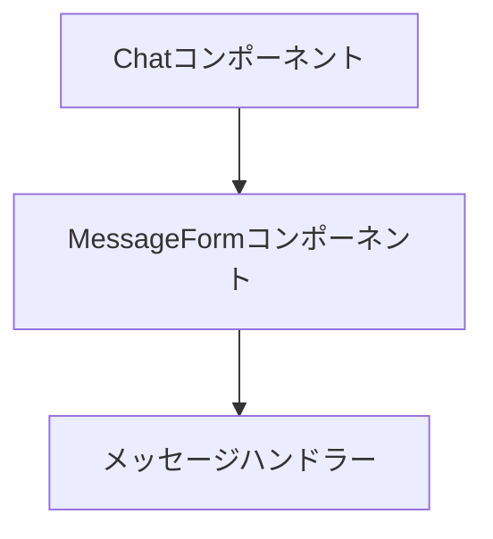
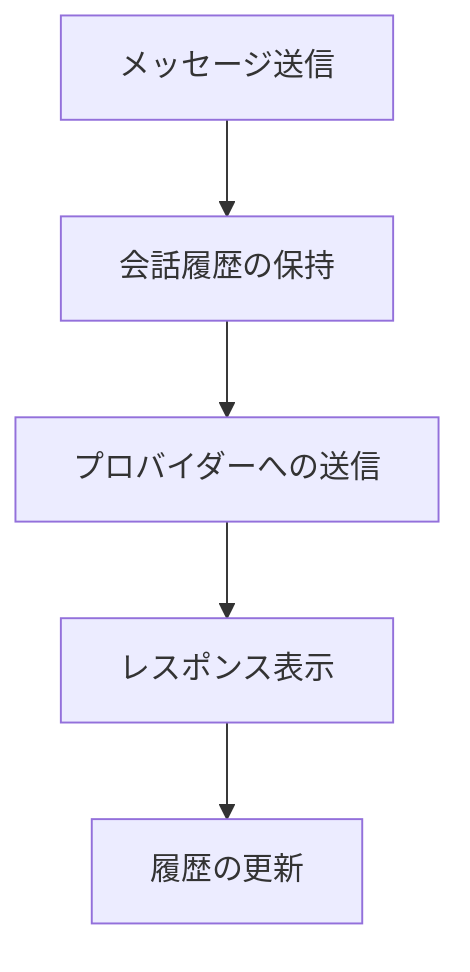

# 開発ステップ計画（v0.1.0）

## 基本方針
1. 垂直スライス開発 - フロントエンドからバックエンドまで薄い機能単位で実装
2. 1PBI = 1つのかたちになる機能
3. 各ステップで動作確認可能な状態を維持

## 開発ロードマップ


## PBI詳細

### PBI-001: プロジェクト基盤構築
**目的**: Chrome拡張機能の基本構造作成

**主なタスク**:
- ✅ 開発環境セットアップ
  - WXT + React + TypeScript環境の構築
  - 静的解析ツールの導入
  - 開発用スクリプトの設定
- ✅ 基本設定
  - wxt.config.tsの設定
  - サイドパネル用エントリーポイントの設定
  - 必要な権限の設定
- ✅ プロジェクト構造
  - ディレクトリ構造の整理
  - 型定義ファイルの配置
  - コンポーネント構成の設計

### PBI-002: メッセージ送受信基盤
**目的**: メッセージの送信から表示までの基本フロー

**主なタスク**:
- ✅ メッセージ入力フォームの実装
  - メッセージ入力UI
  - 送信処理
  - ローディング状態の管理
- ✅ メッセージ表示エリアの作成
  - ユーザー/アシスタントメッセージの表示
  - スタイリングとレイアウト
- ✅ 型定義とメッセージング基盤
  - 共有型の定義
  - メッセージハンドラーの実装
- ⏳ サービスワーカー経由のAPI通信
  - 現在はモック実装
  - API統合準備完了

### PBI-003: メッセージ送受信の基本実装
**目的**: メッセージ送信と表示の基本機能の実装

**主なタスク**:
- ✅ Chatコンポーネントの実装
  - `src/features/Chat.tsx`の作成
  - `tailwind.css`でのレイアウト設定
  - React Contextの初期設定
- ✅ MessageFormコンポーネントの実装
  - `src/components/features/MessageForm.tsx`の作成
  - `useForm`フックでのフォーム管理
  - 送信ボタンとローディング状態
- ✅ メッセージハンドラーの実装
  - `src/core/services/messageHandler.ts`の作成
  - `chrome.runtime.sendMessage`の実装
  - 基本的なレスポンス処理

### PBI-004: チャットインターフェース実装
**目的**: OpenAI APIを使用したチャットインターフェースの実装

**実装手順**:

1. 型定義の追加（`src/types/`）
   - `message.ts`の拡張
     - `ChatMessage`インターフェースの実装
     - `Message`型の拡張
     - `MessageResponse`型の更新

2. WebAPI実装（`src/core/providers/`）
   - `openai.ts`の作成
     ```typescript
     // OpenAIクライアントの初期化と型定義
     export interface ChatCompletionRequest { ... }
     export interface ChatCompletionResponse { ... }
     export async function createChatCompletion() { ... }
     ```

3. ビジネスロジックの実装（`src/core/services/`）
   - `openaiService.ts`の作成
     ```typescript
     // OpenAI APIを使用するサービス層
     export async function processMessage(message: Message): Promise<MessageResponse> { ... }
     ```

4. UIコンポーネントの実装（`src/features/`）
   - `Chat.tsx`の更新
     ```typescript
     // チャットインターフェースコンポーネント
     export const Chat: React.FC = () => {
       const [messages, setMessages] = useState<ChatMessage[]>([]);
       const generateUniqueId = () => { ... };
       // メッセージ処理ロジック
     };
     ```

5. エントリーポイントの更新（`entrypoints/`）
   - `background.ts`の修正
     ```typescript
     // バックグラウンドスクリプトの更新
     import { processMessage } from '../src/core/services/openaiService';
     // メッセージハンドラーの実装
     ```

6. 設定ファイルの更新
   - `wxt.config.ts`
     ```typescript
     export default defineConfig({
       manifest: {
         host_permissions: ['https://api.openai.com/*'],
         // ...
       },
       // 環境変数の設定
     });
     ```
   - `.env`の作成（gitignoreに追加）
     ```env
     OPENAI_API_KEY=your_api_key_here
     ```

**実装済み機能**:
- ✅ 型定義の整備
  - `ChatMessage`インターフェース
  - メッセージ処理の型定義
- ✅ OpenAI APIクライアントの統合
  - WebAPI実装（`providers/openai.ts`）
  - サービス層実装（`services/openaiService.ts`）
- ✅ UIコンポーネントの実装
  - チャットインターフェース（`features/Chat.tsx`）
  - メッセージ表示と送信機能
  - ユニークID生成機能


### PBI-005: AIプロバイダー統合
**目的**: 実際のAIサービスとの連携とAPIキー管理

**変更対象ファイル**:
1. 型定義
   - `src/types/provider.ts` - AIプロバイダーインターフェース定義
   - `src/types/storage.ts` - ストレージ関連の型定義

2. ストレージ実装
   - `src/core/storage/providerKeyStorage.ts` - プロバイダーごとのAPIキー管理実装

3. UIコンポーネント
   - `src/components/features/Chat.tsx` - チャットコンポーネントにAPIキー設定UIを統合
   - `src/components/features/ProviderKeyForm.tsx` - APIキー入力フォームコンポーネント

4. プロバイダー実装
   - `src/core/providers/base.ts` - 基本プロバイダーインターフェース
   - `src/core/providers/openai.ts` - OpenAI用プロバイダー実装

**実装ステップ**:
1. 型定義とインターフェース作成
2. ストレージ機能の実装
3. プロバイダーベース実装
4. UIコンポーネントの統合

### PBI-006: 連続会話機能の実装
**目的**: チャットの文脈を保持し、より自然な対話を実現する



**変更対象ファイル**:
1. 型定義の拡張
   - `src/types/message.ts` - 会話履歴の型定義を拡張
   - `src/types/provider.ts` - プロバイダーインターフェースに会話履歴サポートを追加

2. ストレージ実装
   - `src/core/storage/conversationStorage.ts` - 会話履歴の永続化

3. プロバイダー実装の更新
   - `src/core/providers/base.ts` - 会話履歴サポートの基本実装
   - `src/core/providers/openai.ts` - OpenAIでの会話履歴の利用

4. UIの拡張
   - `src/features/Chat.tsx` - 会話履歴の表示と管理
   - `src/components/features/ConversationControls.tsx` - 会話管理用のUI

**実装ステップ**:
1. 会話履歴の型定義と永続化
   - 会話履歴の構造設計
   - ストレージへの保存と読み込み

2. プロバイダー対応
   - 会話履歴を含めたメッセージ送信
   - プロバイダー別の履歴フォーマット

3. UI実装
   - 会話履歴の表示
   - 会話の保存と読み込み
   - 新規会話の開始

4. 機能拡張
   - 会話のエクスポート/インポート
   - 会話タイトルの自動生成
   - 会話の検索と整理

**静的解析要件**:
- コンポーネント実装前: `npm run ai-code-check analyze-symbol`
- 会話管理機能: `npm run ai-code-check check-file`
