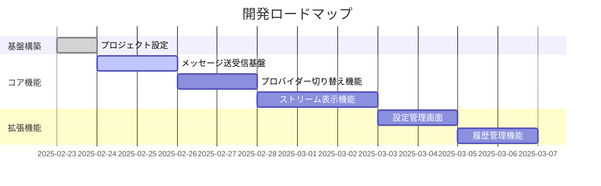
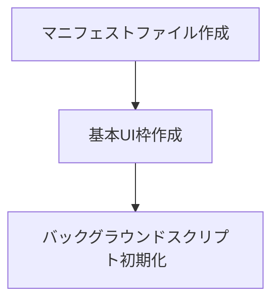
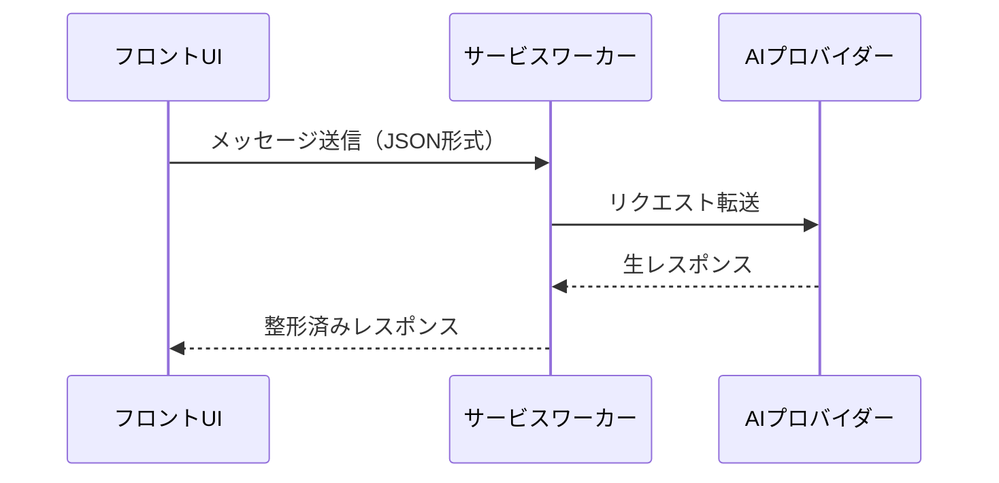
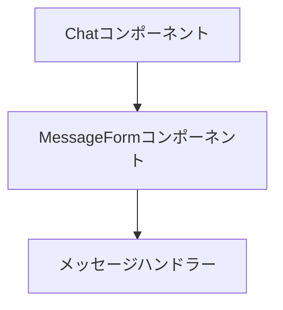
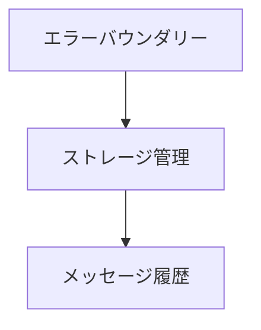
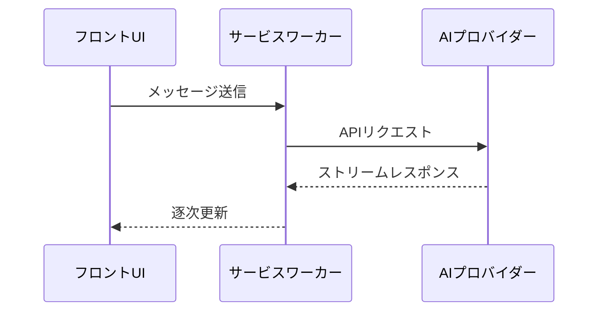

# 開発ステップ計画（v0.1.0）

## 基本方針
1. 垂直スライス開発 - フロントエンドからバックエンドまで薄い機能単位で実装
2. 1PBI = 1つのかたちになる機能
3. 各ステップで動作確認可能な状態を維持

## 開発ロードマップ

## PBI詳細

### PBI-001: プロジェクト基盤構築
**目的**: Chrome拡張機能の基本構造作成

**主なタスク**:
- ✅ 開発環境セットアップ
  - WXT + React + TypeScript環境の構築
  - 静的解析ツールの導入
  - 開発用スクリプトの設定
- ✅ 基本設定
  - wxt.config.tsの設定
  - サイドパネル用エントリーポイントの設定
  - 必要な権限の設定
- ✅ プロジェクト構造
  - ディレクトリ構造の整理
  - 型定義ファイルの配置
  - コンポーネント構成の設計

### PBI-002: メッセージ送受信基盤
**目的**: メッセージの送信から表示までの基本フロー

**主なタスク**:
- ✅ メッセージ入力フォームの実装
  - メッセージ入力UI
  - 送信処理
  - ローディング状態の管理
- ✅ メッセージ表示エリアの作成
  - ユーザー/アシスタントメッセージの表示
  - スタイリングとレイアウト
- ✅ 型定義とメッセージング基盤
  - 共有型の定義
  - メッセージハンドラーの実装
- ⏳ サービスワーカー経由のAPI通信
  - 現在はモック実装
  - API統合準備完了

### PBI-003: メッセージ送受信の基本実装
**目的**: メッセージ送信と表示の基本機能の実装

**主なタスク**:
- ✅ Chatコンポーネントの実装
  - `src/features/Chat.tsx`の作成
  - `tailwind.css`でのレイアウト設定
  - React Contextの初期設定
- ✅ MessageFormコンポーネントの実装
  - `src/components/features/MessageForm.tsx`の作成
  - `useForm`フックでのフォーム管理
  - 送信ボタンとローディング状態
- ✅ メッセージハンドラーの実装
  - `src/core/services/messageHandler.ts`の作成
  - `chrome.runtime.sendMessage`の実装
  - 基本的なレスポンス処理

### PBI-004: エラーハンドリングとメッセージ永続化
**目的**: 安定性とユーザー体験の向上

**主なタスク**:
- エラーハンドリングの実装
  - エラーバウンダリーの設定
  - エラーメッセージのUI
  - 再試行メカニズム
- メッセージ永続化
  - `chrome.storage`の実装
  - 履歴の保存と読み込み
  - 履歴クリア機能
- UIの改善
  - タイピング中の表示
  - 既読状態の管理
  - スクロール位置の保持

### PBI-005: AIプロバイダー統合
**目的**: 実際のAIサービスとの連携

**主なタスク**:
- プロバイダーインターフェースの設計
  - 抽象化レイヤーの作成
  - 設定スキーマの定義
  - APIキー管理
- ストリーミング対応
  - Server-Sent Eventsの実装
  - 逐次表示の実装
  - キャンセル処理
- 設定画面の実装
  - プロバイダー選択UI
  - APIキー設定
  - モデルパラメーター設定
