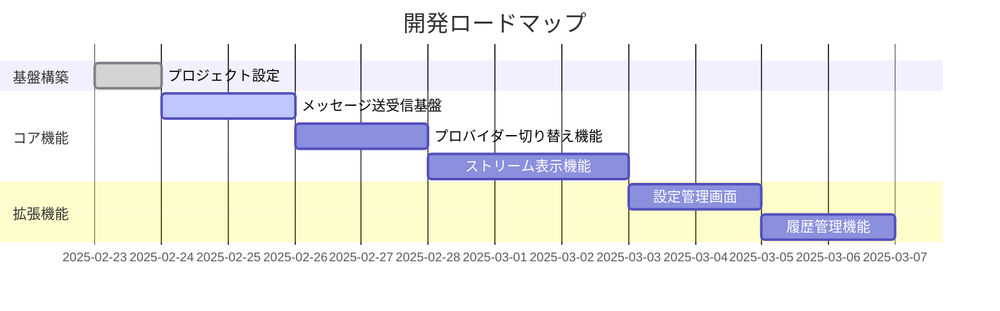
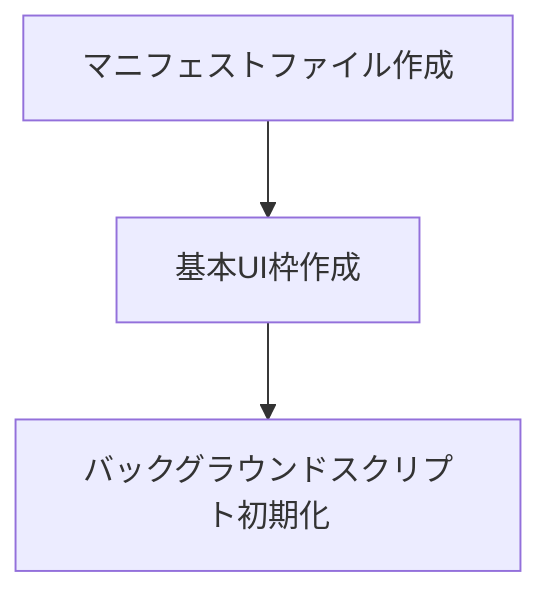
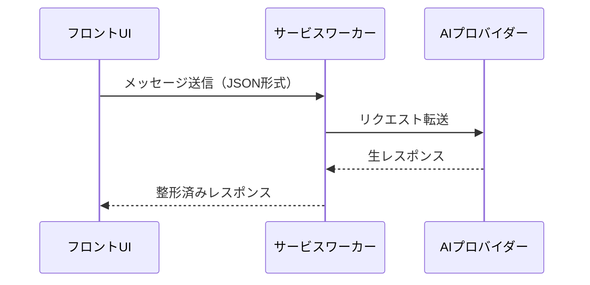
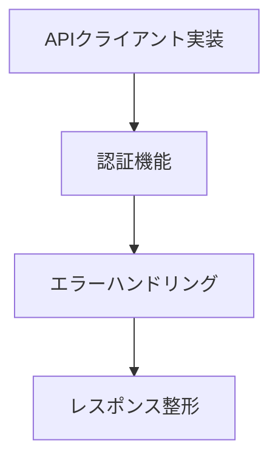

# 開発ステップ計画（v0.1.0）

## 基本方針
1. 垂直スライス開発 - フロントエンドからバックエンドまで薄い機能単位で実装
2. 1PBI = 1つのかたちになる機能
3. 各ステップで動作確認可能な状態を維持

## 開発ロードマップ

## PBI詳細

### PBI-001: プロジェクト基盤構築
**目的**: Chrome拡張機能の基本構造作成

**主なタスク**:
- ✅ 開発環境セットアップ
  - WXT + React + TypeScript環境の構築
  - 静的解析ツールの導入
  - 開発用スクリプトの設定
- ✅ 基本設定
  - wxt.config.tsの設定
  - サイドパネル用エントリーポイントの設定
  - 必要な権限の設定
- ✅ プロジェクト構造
  - ディレクトリ構造の整理
  - 型定義ファイルの配置
  - コンポーネント構成の設計

### PBI-002: メッセージ送受信基盤
**目的**: メッセージの送信から表示までの基本フロー

**主なタスク**:
- ✅ メッセージ入力フォームの実装
  - メッセージ入力UI
  - 送信処理
  - ローディング状態の管理
- ✅ メッセージ表示エリアの作成
  - ユーザー/アシスタントメッセージの表示
  - スタイリングとレイアウト
- ✅ 型定義とメッセージング基盤
  - 共有型の定義
  - メッセージハンドラーの実装
- ⏳ サービスワーカー経由のAPI通信
  - 現在はモック実装
  - API統合準備完了

### PBI-003: APIプロバイダー統合
**目的**: 実際のAIプロバイダーとの統合

**主なタスク**:
- APIクライアントの実装
  - エンドポイント設定
  - リクエスト/レスポンスの型定義
  - 認証ヘッダーの管理
- エラーハンドリング
  - ネットワークエラー
  - API制限エラー
  - 認証エラー
- レスポンス整形処理
  - メッセージフォーマット変換
  - エラーメッセージの適切な表示
- ユーザーフィードバック
  - エラー状態の表示
  - 再試行メカニズム
